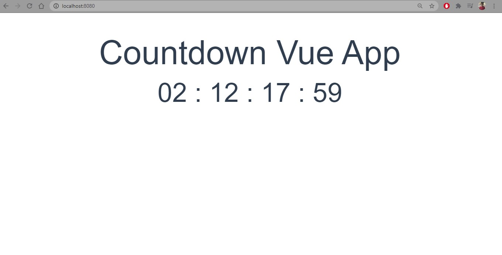

# countdown

simple countdown application based on Vuejs

## How the app looks like

<p>
  
</p>

### live preview of the app

[https://jovial-bartik-94cec9.netlify.app/](https://jovial-bartik-94cec9.netlify.app/)

## Project setup

```
npm install
```

### Compiles and hot-reloads for development

```
npm run serve
```

### Compiles and minifies for production

```
npm run build
```

### Lints and fixes files

```
npm run lint
```

### Customize configuration

See [Configuration Reference](https://cli.vuejs.org/config/).
